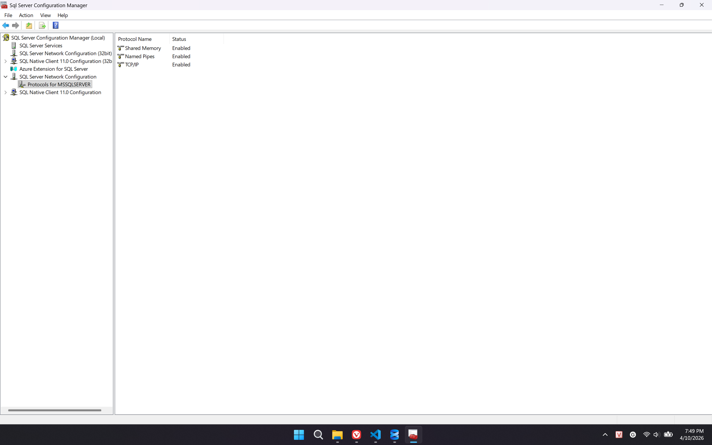
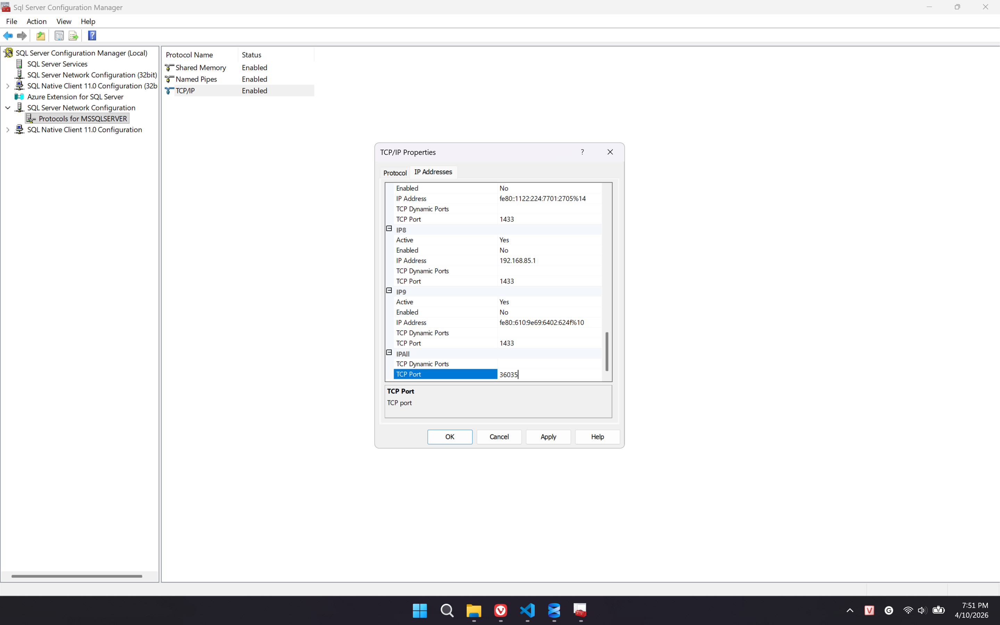
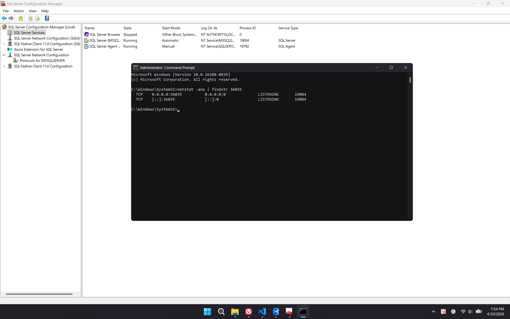
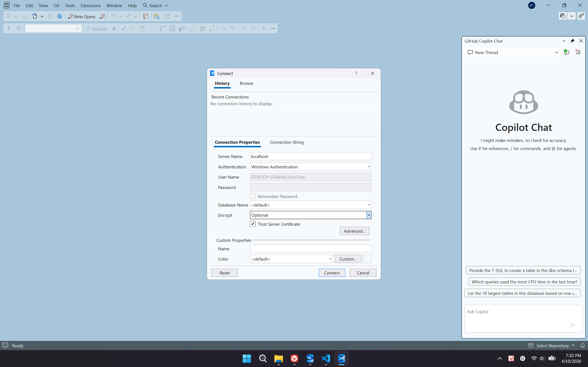
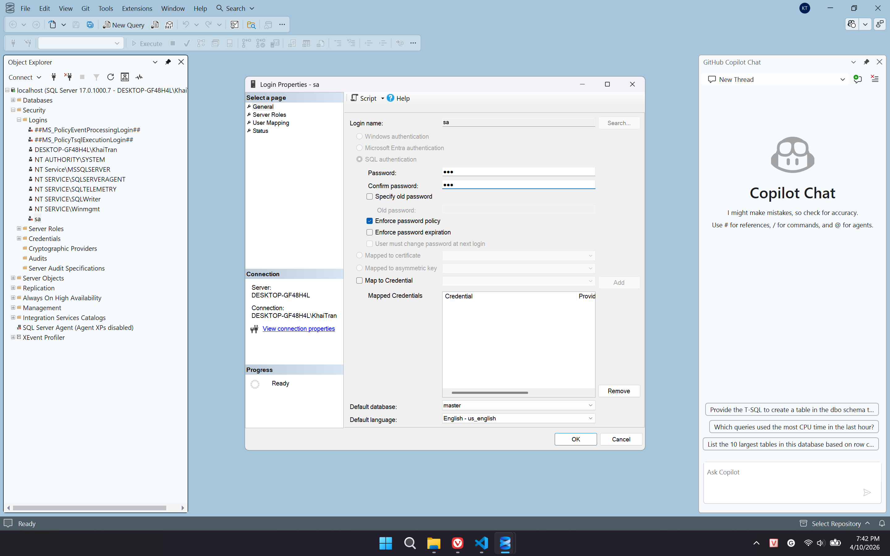
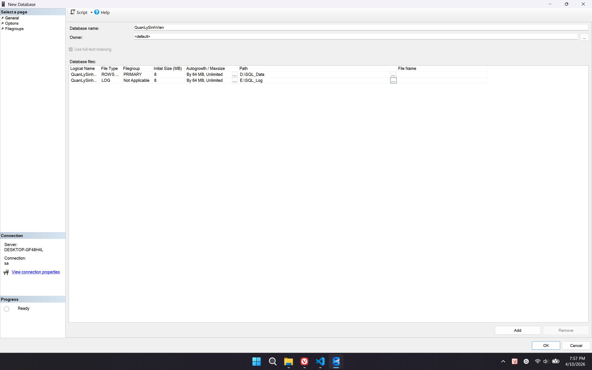
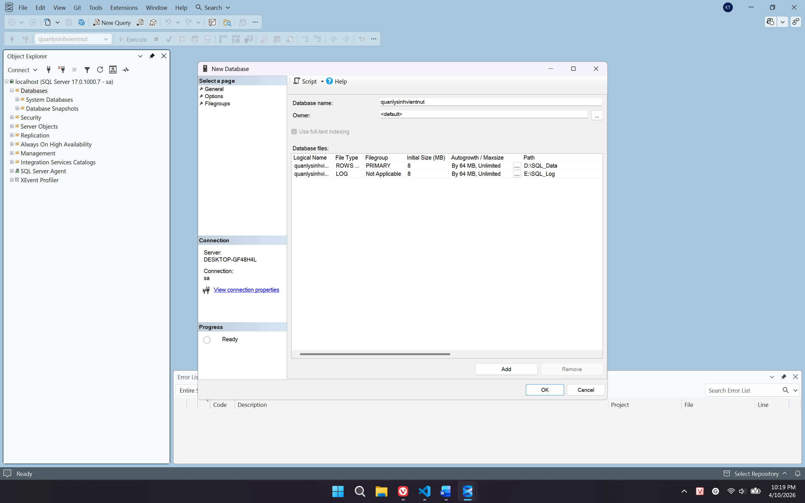
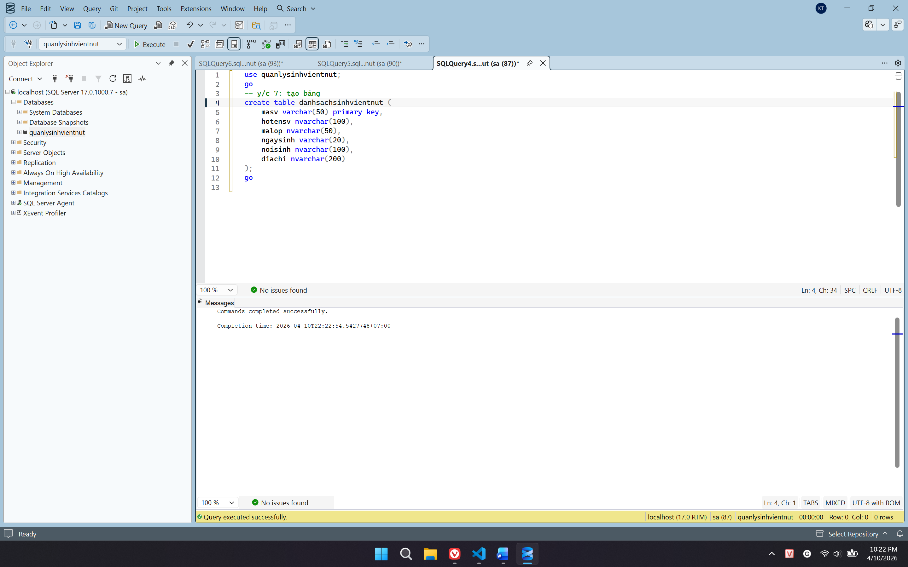

BAITAP1_CSDL
BÁO CÁO THỰC HÀNH CƠ SỞ DỮ LIỆU - BÀI SỐ 1
THÔNG TIN SINH VIÊN
Họ và tên: Trần Văn Khải
Mã sinh viên: K235480106035
Lớp: K59.KMT
Học phần: Hệ quản trị dữ liệu

CHI TIẾT CÁC BƯỚC THỰC HIỆN
1. Cài đặt và cấu hình môi trường (Yêu cầu 1 - 5)
Thực hiện cài đặt SQL Server 2025 Standard Developer Edition, công cụ SSMS và cấu hình giao thức mạng TCP/IP Port 1433 để chuẩn bị môi trường thực hành.
1.1 Trạng thái cài đặt SQL Server thành công.

1.2 Kích hoạt giao thức TCP/IP trong SQL Server Configuration Manager.




1.3 Kiểm tra xem service SQL Server có đang running và mở đúng không.

1.4 Cài đặt SQL Server Management Studio.

1.5 Chạy phần mềm ssms để Đăng nhập vào SQL Server Authentication.




2. Tạo Cơ sở dữ liệu (Yêu cầu 6)
Tạo Database `QuanLySinhVien` và thiết lập nơi lưu trữ các tệp vật lý nhằm tối ưu hóa hiệu suất và quản lý dữ liệu dễ dàng hơn.

2.1 Cấu hình Path cho tệp .mdf (Data) và .ldf (Log). 


3. Khởi tạo cấu trúc bảng (Yêu cầu 7)
Tạo bảng danhsachsinhvien với các trường dữ liệu được định nghĩa kiểu dữ liệu phù hợp để chứa thông tin sinh viên.

```sql
CREATE TABLE DanhSachSinhVien (
    masv VARCHAR(50) PRIMARY KEY,
    hotensv NVARCHAR(100),
    malop NVARCHAR(50),
    ngaysinh VARCHAR(20),
    noisinh NVARCHAR(100),
    diachi NVARCHAR(500)
);


4. Nạp dữ liệu từ tệp CSV (Yêu cầu 8)
Sử dụng lệnh BULK INSERT để nạp khối lượng lớn dữ liệu từ tệp svtnut.csv vào bảng đã tạo, sử dụng CODEPAGE = '65001' để hỗ trợ tiếng Việt.

BULK INSERT danhsachsinhvien
FROM 'D:\thuchanhsql\svtnut.csv'
WITH (
    FIRSTROW = 2,
    FORMAT = 'CSV',
    CODEPAGE = '65001'
);

4.1 Nạp dữ liệu thành công (12020 rows affected).


5. Kiểm tra và Ghi danh cá nhân (Yêu cầu 9 - 10)
Xác nhận tổng số dòng trong cơ sở dữ liệu và thêm bản ghi chứa thông tin cá nhân của sinh viên thực hiện bài Lab.

5.1 Kiểm tra số lượng dòng bằng lệnh COUNT().


5.2 Thêm thành công bản ghi của SV Trần Văn Khải.


6. Xử lý dữ liệu và Tạo bảng phụ (Yêu cầu 11 - 13)
Cập nhật các trường thông tin trống thành "Sao Hỏa", sau đó sử dụng SELECT INTO để tách các sinh viên này sang bảng saohoa và thực hiện lọc dữ liệu theo họ sinh viên.

6.1 Thực hiện lệnh SELECT INTO để tách bảng.


6.2 Thực thi lệnh DELETE lọc sinh viên họ Trần trong bảng saohoa.

7. Xuất Script tổng hợp (Yêu cầu 14)
Sử dụng tính năng Generate Scripts để sao lưu toàn bộ cấu trúc bảng và dữ liệu (Schema and Data) ra tệp tin script.

7.1 Chọn chế độ "Schema and data" trong Advanced Options.

8. Xóa Database và kiểm tra tệp vật lý (Yêu cầu 15)
Thực hiện xóa Database trên giao diện SSMS và kiểm tra thư mục lưu trữ để xác nhận các tệp .mdf, .ldf đã được xóa sạch khỏi ổ đĩa.

8.1 Thực hiện lệnh Delete Database và kiểm tra thư mục trống.

9. Phục hồi dữ liệu từ file Script (Yêu cầu 16)
Mở file script đã xuất và chạy lại toàn bộ câu lệnh để khôi phục cơ sở dữ liệu và kiểm chứng kết quả.

9.1 Dữ liệu được phục hồi nguyên vẹn sau khi thực thi script.

KẾT THÚC BÁO CÁO